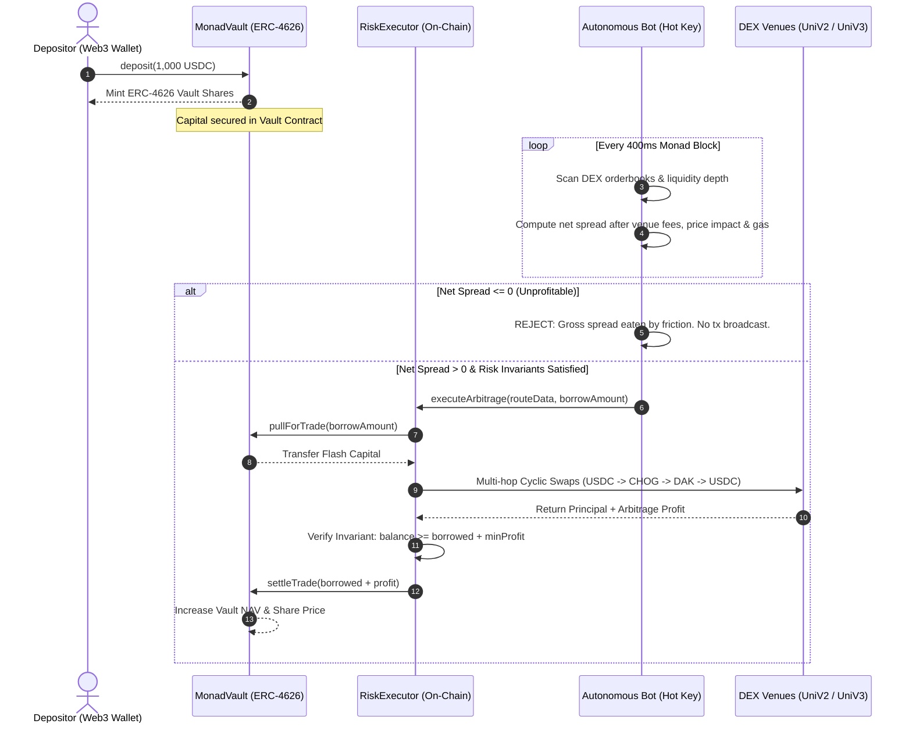

# 🛡️ Warden — Autonomous Trading Vault on Monad

[](https://monad.xyz)
[](https://youtu.be/z7WPtDbIuNA)
[](./LICENSE)
[](https://warden-five-green.vercel.app/)
[](https://testnet.monadscan.com)
[](./contracts)
[](./engine)

> **Warden** is a production-oriented, non-custodial autonomous trading vault built natively on Monad. It pairs intelligent off-chain cyclic arbitrage discovery with **deterministic on-chain mathematical risk guardrails**, an agent key with **zero withdrawal authority**, and **atomic single-transaction flash loans** settled inside Monad's 400ms blocks.

---

## 📑 Table of Contents

1. [Project Links](#-project-links)
2. [The Core Problem in DeFi Automation](#-the-core-problem-in-defi-automation)
3. [The Warden Solution](#-the-warden-solution)
4. [Why Monad? (The Architectural Match)](#-why-monad-the-architectural-match)
5. [System Architecture](#-system-architecture)
6. [On-Chain Invariants & Mathematical Model](#-on-chain-invariants--mathematical-model)
7. [Deployed Contracts (Monad Testnet)](#-deployed-contracts-monad-testnet)
8. [Component Breakdown](#-component-breakdown)
9. [Quickstart & Verification Guide](#-quickstart--verification-guide)
10. [Test Suites & Coverage](#-test-suites--coverage)
11. [Metropolis Hackathon Disclosures](#-metropolis-hackathon-disclosures)
12. [License](#-license)

---

## 🔗 Project Links

| Resource | URL | Description |
| :--- | :--- | :--- |
| **Demo Video** | [youtu.be/z7WPtDbIuNA](https://youtu.be/z7WPtDbIuNA) | Full architecture and live product walkthrough on YouTube |
| **Live Web Application** | [warden-five-green.vercel.app](https://warden-five-green.vercel.app/) | Deployed production dashboard connected to Monad Testnet |
| **GitHub Repository** | [github.com/Rampop01/Warden](https://github.com/Rampop01/Warden) | Complete open-source codebase under MIT License |

---

## ⚠️ The Core Problem in DeFi Automation

Automated trading in decentralized finance suffers from three fatal architectural vulnerabilities:

1. **The Custodial Trap (Key Risk)**: Traditional trading bots demand users surrender their private keys or transfer assets to hot bot wallets. If the bot is compromised, funds are instantly drained.
2. **The "Gross Spread" Illusion (Toxic Executions)**: Most naive bots execute trades whenever a simple price difference is detected. They ignore AMM constant-product price impact, DEX venue fees, and Monad gas. Consequently, high gross spreads turn into catastrophic net losses on execution.
3. **The Unchecked Autonomous Agent (Black-Box AI)**: Letting an LLM or neural policy directly broadcast raw execution calls creates unpredictable failure modes. Language models hallucinate calldata, misjudge liquidity depth, and cannot be trusted with financial custody.

---

## 🛡️ The Warden Solution

Warden eliminates these vulnerabilities by decoupling **opportunity identification** from **execution authority**:

```
┌────────────────────────────────────────────────────────────────────────┐
│                          WARDEN SECURITY MODEL                         │
├────────────────────────────┬───────────────────────────────────────────┤
│ 1. Vault Owns the Funds    │ User capital resides strictly in an       │
│                            │ immutable ERC-4626 vault contract.        │
├────────────────────────────┼───────────────────────────────────────────┤
│ 2. Zero-Withdraw Authority │ The agent key has ZERO withdrawal rights. │
│                            │ It is cryptographically impossible for   │
│                            │ the bot to transfer user funds away.      │
├────────────────────────────┼───────────────────────────────────────────┤
│ 3. Deterministic Sentinel  │ Pure on-chain mathematical invariants     │
│                            │ approve or reject every route. Net spread │
│                            │ must exceed all friction before execution.│
├────────────────────────────┼───────────────────────────────────────────┤
│ 4. Atomic 1-Tx Execution   │ Flash liquidity is pulled, swapped, and   │
│                            │ returned in the exact same block. Zero    │
│                            │ liquidation risk; zero multi-block MEV.   │
└────────────────────────────┴───────────────────────────────────────────┘
```

---

## ⚡ Why Monad? (The Architectural Match)

Warden was built ground-up for the **Monad blockchain** because its execution properties enable an entirely new tier of non-custodial finance:

* **Sub-Second Block Times (~400ms)**: Traditional blockchains allow price discrepancies to persist for minutes, leading to toxic MEV searcher wars. On Monad, Warden scans the testnet mempool every 400ms, capturing rapid cyclical mispricings across decentralized liquidity pools.
* **10,000 TPS High Throughput**: Rapid multi-hop atomic routing requires deterministic inclusion without network congestion spikes. Monad’s parallel execution pipeline ensures flash loans complete in the identical block.
* **Micro-Yield Viability (Low Gas)**: On Ethereum L1, a 16 bps arbitrage net profit on a $1,000 swap ($1.60) is completely obliterated by $15–$50 in gas costs. On Monad, gas costs fractions of a cent (~$0.0004), making micro-arbitrage consistently profitable for vault depositors.

---

## 🏗️ System Architecture



---

## 📐 On-Chain Invariants & Mathematical Model

### 1. Frictional Math Engine
A trade is **never** executed based on gross spread alone. The engine calculates net edge after all friction:

$$\text{Net Yield (bps)} = \text{Gross Spread} - \left(\sum \text{DEX Fees} + \text{Price Impact}(x, \Delta x) + \frac{\text{Gas Cost}}{\text{Trade Size}}\right)$$

Where constant-product price impact for each hop is modeled as:

$$\Delta y = \frac{y \cdot \Delta x \cdot (1 - \gamma)}{x + \Delta x \cdot (1 - \gamma)}$$

### 2. Hard Invariants Enforced in `RiskExecutor.sol`

| Invariant | Value | Enforcement Mechanism |
| :--- | :--- | :--- |
| **Max Single Borrow Cap** | `$5,000.00 USDC` | Reverts on-chain in `pullForTrade` if exceeded |
| **Max Vault Allocation** | `20% of Total NAV` | Enforced dynamically against live vault assets |
| **Max Slippage Floor** | `0.50% (50 bps)` | Minimum return tokens calculated per swap hop |
| **Daily Loss Circuit Breaker** | `$50.00 USD / Day` | Hard stop tracked over rolling 24-hour window |
| **Max Hop Count** | `3 Hops` | Reverts multi-hop paths with combinatorial risk |
| **Single-Transaction Atomicity** | `1 Block / 1 Tx` | Must call `settleTrade` within the identical transaction |

---

## 📍 Deployed Contracts (Monad Testnet)

**Network:** Monad Testnet  
**Chain ID:** `10143` (`0x279f`)  
**RPC Endpoint:** `https://testnet-rpc.monad.xyz`  
**Block Explorer:** `https://testnet.monadscan.com`

| Contract | Address | Verification Status | Explorer Link |
| :--- | :--- | :--- | :--- |
| **`MonadVault`** | `0xd9fc6cC979472A5FA52750ae26805462E1638872` | Verified ERC-4626 | [View on Monadscan](https://testnet.monadscan.com/address/0xd9fc6cC979472A5FA52750ae26805462E1638872) |
| **`RiskExecutor`** | `0x274f499201b0716e6CB632FF5BEc10cAD508eAD6` | Verified Executor | [View on Monadscan](https://testnet.monadscan.com/address/0x274f499201b0716e6CB632FF5BEc10cAD508eAD6) |
| **`Base Asset (USDC)`** | `0x534b2f3A21130d7a60830c2Df862319e593943A3` | Verified ERC-20 | [View on Monadscan](https://testnet.monadscan.com/token/0x534b2f3A21130d7a60830c2Df862319e593943A3) |
| **`Agent Hot Key`** | `0x2c55614E7fC28894F55a7169ce0af42FAFF5E457` | Authorized Submitter | Zero withdrawal permissions |

---

## 🧩 Component Breakdown

```

├── contracts/               # Solidity Smart Contracts (Foundry)
│   ├── src/
│   │   ├── MonadVault.sol   # ERC-4626 vault with virtual shares & flash loans
│   │   ├── RiskExecutor.sol # Invariant enforcement & circuit breaker engine
│   │   ├── adapters/        # UniV2 & UniV3 DEX venue wrappers
│   │   └── interfaces/      # On-chain interfaces & error signatures
│   └── test/                # 29 Foundry test suites (fuzz, invariants, pause)
│
├── engine/                  # Off-Chain Execution Engine & Simulator (Node.js)
│   ├── src/
│   │   ├── arbitrageSimulator.js # Bellman-Ford cyclic arbitrage math & pricing
│   │   ├── riskSentinel.js       # Pre-flight deterministic invariant validator
│   │   ├── aiAgent.js            # Telemetry explainability & audit generator
│   │   ├── ledger.js             # Double-entry idempotent accounting
│   │   └── server.js             # Real-time state service & JSON-RPC indexer
│   └── test/                # 14 Unit & Integration test suites
│
└── dashboard/               # Web3 Operator & Depositor Terminal (React 18 + Vite)
    ├── src/
    │   ├── App.jsx                 # Live Monad Web3 provider, wallet & deposit flow
    │   ├── components/
    │   │   ├── LandingPage.jsx     # Institutional landing page & overview
    │   │   ├── AgentCommandCenter.jsx # Real-time daemon telemetry & cycle triggers
    │   │   └── ParticleVortexCanvas.jsx # GPU-accelerated interactive background
    └── public/              # Production static assets & web client build
```

---

## 🚀 Quickstart & Verification Guide

### Prerequisites
* **Node.js**: v18.0.0 or higher
* **Foundry**: `forge` and `cast` installed ([foundry.paradigm.xyz](https://getfoundry.sh/))
* **Git**: Installed

### 1. Smart Contract Verification (Foundry)
Run the full Solidity test suite covering virtual share inflation mitigation, circuit breakers, and atomic settlement:
```bash
cd contracts
forge test -v
```
*Expected: 29 tests passing (100% green).*

### 2. Execution Engine & Frictional Math Tests
Run the deterministic arbitrage simulator and ledger verification tests:
```bash
cd ../engine
npm install
npm test
```
*Expected: 14 tests passing across cyclic discovery, slippage deductions, and ledger idempotency.*

### 3. Start the Live Indexer & State Daemon
Launch the background state server that listens to Monad Testnet blocks and serves JSON-RPC telemetry:
```bash
cd engine
npm start
```
*Runs on `http://127.0.0.1:4000` with live Monad block synchronization.*

### 4. Launch the Web3 Dashboard
In a separate terminal, launch the Web3 interface:
```bash
cd ../dashboard
npm install
npm run dev
```
*Open `http://localhost:5173` in your browser. Connect MetaMask to Monad Testnet (Chain ID 10143) to interact with the vault.*

---

## 🧪 Test Suites & Coverage

### Smart Contract Invariants Tested (`contracts/test/`)
- `test_DepositAndMintShares()`: Validates ERC-4626 share conversion rates.
- `test_VirtualSharesInflationAttackMitigation()`: Validates protection against donation/inflation attacks.
- `test_PullForTradeOnlyRiskExecutor()`: Asserts that arbitrary callers cannot pull vault assets.
- `test_SettleTradeEnforcesRepayment()`: Asserts revert if returned amount is less than borrowed.
- `test_DailyCircuitBreakerTrigger()`: Simulates successive losses exceeding $50/day and confirms automatic trading halt.
- `test_GuardianEmergencyPause()`: Confirms trading pauses while depositor withdrawals remain functional.

### Engine Invariants Tested (`engine/test/`)
- `test_BellmanFordNegativeCycle()`: Tests cyclic path identification across USDC $\rightarrow$ CHOG $\rightarrow$ DAK $\rightarrow$ USDC.
- `test_GrossVsNetSpreadDeductions()`: Validates that an apparent +18 bps gross spread is correctly rejected when friction is 42 bps.
- `test_DoubleEntryLedgerIdempotency()`: Validates accounting replay protection across blockchain reorgs.

---

## 🏆 Metropolis Hackathon Disclosures

* **Hackathon**: Monad Metropolis Hackathon (September 1 – November 3, 2026)
* **Track**: **Track 01 — Onchain Finance & Trading**
* **Originality & Build Window**: The substantial majority of the Warden smart contracts, execution engine, and Web3 dashboard were designed and implemented during the official hackathon build window.
* **Disclosure of AI Coding Tools**: In strict adherence to **Section 4.1 of the Hackathon Rules**, modern AI-assisted engineering tools (Anthropic Claude and Google Antigravity IDE) were utilized during development for architecture ideation, boilerplate generation, and test scaffolding. All smart contract security logic, mathematical invariants, and deployment configurations have been manually verified and tested.
* **External Libraries Attributed**:
  - OpenZeppelin Contracts v5.0 (ERC-4626, ERC-20, Pausable, ReentrancyGuard)
  - ethers.js v6 (Web3 contract integration)
  - Vite & React 18 (Frontend framework)

---

## 📄 License

This repository is licensed under the **[MIT License](./LICENSE)**.  
All contract source code and engine components are completely open-source and free to inspect, run, and build upon.
